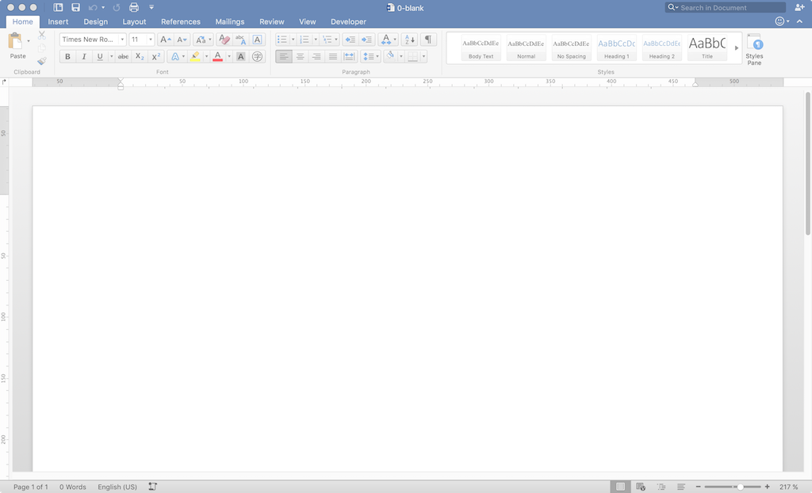
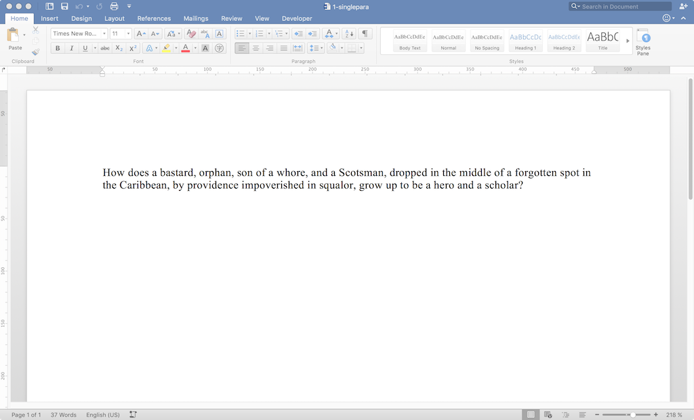

=========================
Adding a Single Paragraph
=========================

.. highlight:: xml

Procedure
---------

I started with a blank file:

And added a single paragraph:

Results
-------

Document XML Changes
~~~~~~~~~~~~~~~~~~~~

The blank :code:`word/document.xml` file has, thankfully, a pretty minimal and manageable structure::

    <w:body>
     <w:p w14:paraId="2755313D" w14:textId="77777777" w:rsidR="00617040" w:rsidRDefault="00617040">
      <w:bookmarkStart w:id="0" w:name="_GoBack"/>
      <w:bookmarkEnd w:id="0"/>
     </w:p>
     <w:sectPr w:rsidR="00617040" w:rsidSect="00E7316D">
      <w:pgSz w:h="15840" w:w="12240"/>
      <w:pgMar w:bottom="1440" w:footer="720" w:gutter="0" w:header="720" w:left="1440" w:right="1440" w:top="1440"/>
      <w:cols w:space="720"/>
      <w:docGrid w:linePitch="360"/>
     </w:sectPr>
    </w:body>

With some paraphrasing and eliding, it's more clear::

    <body>
     

      <bookmarkStart/>
      <bookmarkEnd/>
     

     <sectionProperty>
      <pageSize/>
      <pageMargin/>
      <cols>
      <docGrid>
     </sectionProperty>
    </body>

One paragraph, with some kind of bookmark, and some high-level
page layout settings. Cool.
Adding one paragraph to the blank produced this (including only the relevant part)::

    <w:p w14:paraId="2755313D" w14:textId="22B9D595" w:rsidR="00617040" w:rsidRDefault="009D3123">
     <w:r w:rsidRPr="009D3123">
      <w:t>
       How does a bastard, orphan, son of a whore, and a Scotsman, dropped in the middle of a forgotten spot in the Caribbean, by providence impoverished in squalor, grow up to be a hero and a scholar?
      </w:t>
     </w:r>
     <w:bookmarkStart w:id="0" w:name="_GoBack"/>
     <w:bookmarkEnd w:id="0"/>
    </w:p>

As paraphrased::

   

    <r>
     <t>
       How does a bastard, orphan, son of a whore,
       and a Scotsman, dropped in the middle of
       a forgotten spot in the Caribbean,
       by providence impoverished in squalor,
       grow up to be a hero and a scholar?
     </t>
    </r>
    <bookmarkStart/>
    <bookmarkEnd/>
   

Now there's a `run` and a `text` tag surrounding the text I entered.
Nothing else get_changed.

Other Changes
~~~~~~~~~~~~~

In :code:`word/settings.xml` there are two new :code:`<w:rsid>` tags, inserted with the others alphabetically:

+  :code:`<w:rsid w:val="009D3123"/>`
+  :code:`<w:rsid w:val="00FD3E79"/>`

In :code:`docProps/app.xml` a few counts were modified for the new content:

- :code:`TotalTime` from 0 to 1
- :code:`Words` from 0 to 29
- :code:`Characters` from 0 to 166
- :code:`Lines` from 0 to 1
- :code:`Paragraphs` from 0 to 1
- :code:`CharacterWithSpaces` from 0 to 194

