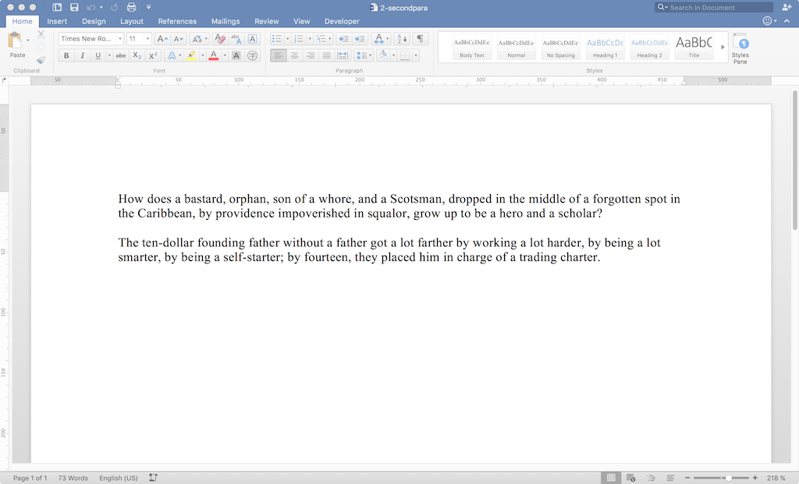

=========================
Adding a Second Paragraph
=========================

.. highlight:: xml

Procedure
---------

Starting with a single paragraph:

.. image:: ./screenshots/1-singlepara1024.png

I added a second paragraph:

Results
-------

Document XML Changes
~~~~~~~~~~~~~~~~~~~~

Something went wrong. Adding the first paragraph gave me this::

    <body>
     

      <r>
       <t>
        How does a bastard, orphan, son of a whore,
        and a Scotsman, dropped in the middle of
        a forgotten spot in the Caribbean,
        by providence impoverished in squalor,
        grow up to be a hero and a scholar?
       </t>
      </r>
      <bookmarkStart/>
      <bookmarkEnd/>
     

     <sectionProperty>
      <pageSize/>
      <pageMargin/>
      <cols>
      <docGrid>
     </sectionProperty>
    </body>

Somehow, the second paragraph yielded *this*::

    <body>
     

      <r>
       <t>
        How does a bastard, orphan, son of a whore,
        and a Scotsman, dropped in the middle of
        a forgotten spot in the Caribbean,
        by providence impoverished in squalor,
        grow up to be a hero and a scholar?
       </t>
      </r>
     

     

      <r>
       <t>
        The ten-dollar founding father without a father
        got a lot farther by working a lot harder,
        by being a lot smarter, by being a self-starter;
        by fourteen, they placed him
       </t>
      </r>
      <r>
       <t>
        in charge of a trading charter.
       </t>
      </r>
      <bookmarkStart/>
      <bookmarkEnd/>
     

     <sectionProperty>
      <pageSize/>
      <pageMargin/>
      <cols>
      <docGrid>
     </sectionProperty>
    </body>

What happened? Somehow, the second paragraph got divided
into a pair of runs. I recreated the docx and the same
thing happened, in the same location. I wonder what it means.

Other Changes
~~~~~~~~~~~~~

Another :code:`<w:rsid>` in :code:`word/settings.xml`: :code:`<w:rsid w:val="00B61498"/>`

What does it mean?

The :code:`<sectionProperty>` tag changed:
the :code:`<w:rsidR>` attribute changed
from "00617040" to "00B61498"...
Which is also the number from just above...

The :code:`docProps/app.xml` counts changed again:

- :code:`Words` from 29 to 59
- :code:`Characters` from 166 to 337
- :code:`Lines` from 1 to 2
- :code:`CharacterWithSpaces` from 194 to 395

:code:`Paragraphs`...did not change...?! Still 1.
Maybe because I didn't put a linefeed at the end
of the second paragraph?
