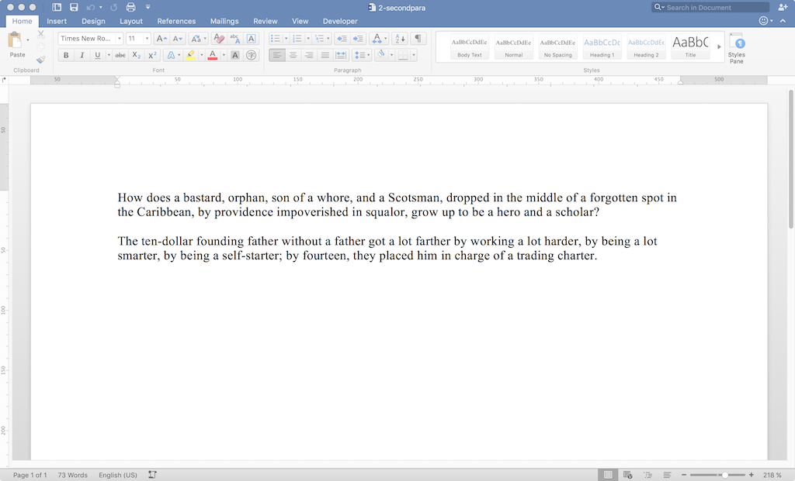

============
Adding a Run
============

.. highlight:: xml

Procedure
---------

Starting with a two-paragraph docx file:

I made one word bold:

Results
-------

Document XML Changes
~~~~~~~~~~~~~~~~~~~~

We started with this::

    <body>
     

      <r>
       <t>
        How does a bastard, orphan, son of a whore,
        and a Scotsman, dropped in the middle of
        a forgotten spot in the Caribbean,
        by providence impoverished in squalor,
        grow up to be a hero and a scholar?
       </t>
      </r>
     

     

      <r>
       <t>
        The ten-dollar founding father without a father
        got a lot farther by working a lot harder,
        by being a lot smarter, by being a self-starter;
        by fourteen, they placed him
       </t>
      </r>
      <r>
       <t>
        in charge of a trading charter.
       </t>
      </r>
      <bookmarkStart/>
      <bookmarkEnd/>
     

     <sectionProperty>
      <pageSize/>
      <pageMargin/>
      <cols>
      <docGrid>
     </sectionProperty>
    </body>

With the new run, we have this::

    <body>
     

      <r>
       <t>
        How does a bastard, orphan, son of a whore,
        and a Scotsman, dropped in the middle of
        a forgotten spot in the Caribbean,
        by providence impoverished in squalor,
        grow up to be a hero and a scholar?
       </t>
      </r>
     

     

      <r>
       <t>
        The ten-dollar founding
       </t>
      </r>
      <r>
       <rProperty>
        <b/>
       </rProperty>
       <t>
        father
       </t>
      </r>
      <r>
       <t>
        witho
       </t>
      </r>
      <bookmarkStart/>
      <bookmarkEnd/>
      <r>
       <t>
        ut a father got a lot farther
        by working a lot harder,
        by being a lot smarter,
        by being a self-starter;
        by fourteen, they placed him
       </t>
      </r>
      <r>
       <t>
        in charge of a trading charter.
       </t>
      </r>
     

     <sectionProperty>
      <pageSize/>
      <pageMargin/>
      <cols>
      <docGrid>
     </sectionProperty>
    </body>

So, here's what happened:

- The :code:`<bookmark/>` tags moved up.
- The :code:`<sectionProperty>`'s
  :code:`rsidR` attribute changed again from
  "00B61498" to "00F564C0".
- The :code:`rsidRPr` attribute
  for the run surrounding the
  second paragraph changed from
  "00B61498" to "00F564C0",
  which is the same as for the run
  that starts with "witho" and "ut a father got...".
- The attributes for the first paragraph all changed::

    -   <w:p w14:paraId="6657B44B" w14:textId="24C88B5A" w:rsidR="00B61498" w:rsidRDefault="00B61498">
    +   <w:p w14:paraId="60C4CAE9" w14:textId="6037BB23" w:rsidR="00F564C0" w:rsidRDefault="00F564C0">

Other Changes
~~~~~~~~~~~~~

Lost one :code:`<w:rsid>` and gained gained two::

    -  <w:rsid w:val="00B61498"/>
    +  <w:rsid w:val="00E326CC"/>
    +  <w:rsid w:val="00F564C0"/>

No changes in the :code:`docProps/app.xml` counts:

- :code:`Words` is the same, 59
- :code:`Characters` is the same, 337
- :code:`Lines` is the same, 2
- :code:`CharacterWithSpaces` is the same, 395
- :code:`Paragraphs` is the same, 1...
