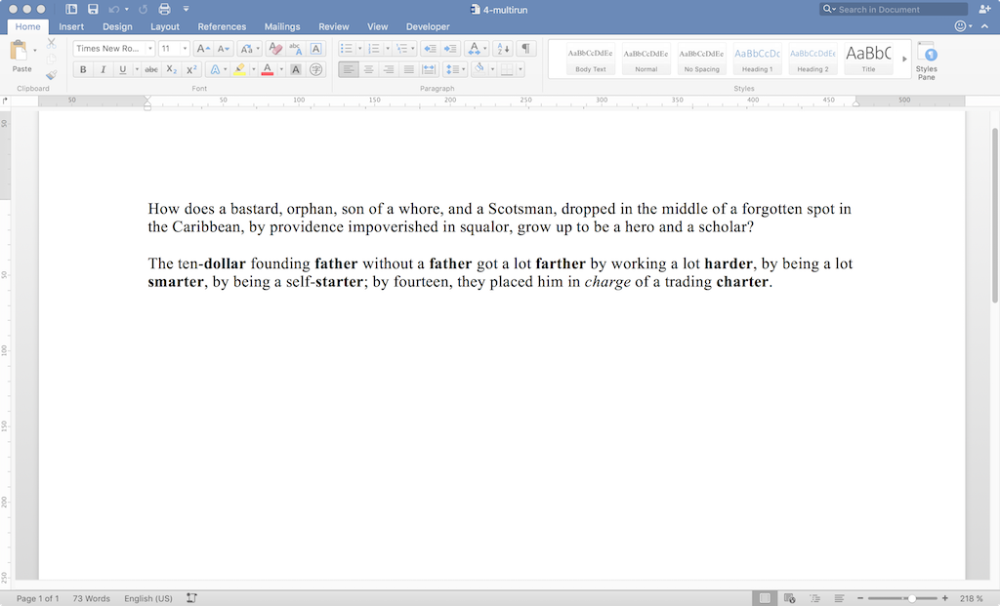

====================
Adding Multiple Runs
====================

.. highlight:: xml

Procedure
---------

Starting with a two-paragraph docx file with one bold word:

.. image:: ./screenshots/3-singlerun1024.png

I made a few other words bold and one italic:

Results
-------

Document XML Changes
~~~~~~~~~~~~~~~~~~~~

Strap in. Starting with one run::

    <body>
     

      <run>
        How does a bastard, orphan, son of a whore,
        and a Scotsman, dropped in the middle of
        a forgotten spot in the Caribbean,
        by providence impoverished in squalor,
        grow up to be a hero and a scholar?
     

     

      <run>
        The ten-dollar founding
      <r>
       <rProperty>
        <b/>
       </rProperty>
       <t>
        father
       </t>
      </r>
      <r>
       <t>
        witho
       </t>
      </r>
      <bookmarkStart/>
      <bookmarkEnd/>
      <r>
       <t>
        ut a father got a lot farther
        by working a lot harder,
        by being a lot smarter,
        by being a self-starter;
        by fourteen, they placed him
       </t>
      </r>
      <r>
       <t>
        in charge of a trading charter.
       </t>
      </r>
     

     <sectionProperty>
      <pageSize/>
      <pageMargin/>
      <cols>
      <docGrid>
     </sectionProperty>
    </body>

We now have a seemingly endless amount::

    <body>
     

      <run>
        How does a bastard, orphan, son of a whore,
        and a Scotsman, dropped in the middle of
        a forgotten spot in the Caribbean,
        by providence impoverished in squalor,
        grow up to be a hero and a scholar?

     

      <run> The ten-                            <!-- 1 -->
      <boldrun> dollar                          <!-- 2 -->
      <run> founding                            <!-- 1 -->
      <boldrun> father                          <!-- 3 -->
      <run> without a                           <!-- 1 -->
      <boldrun> father                          <!-- 2 -->
      <run> got a                               <!-- 1 -->
      <bookmark/>
      <run> lot                                 <!-- 1 -->
      <boldrun> farther                         <!-- 2 -->
      <run> by working a lot                    <!-- 1 -->
      <boldrun> harder                          <!-- 2 -->
      <run> , by being a lot                    <!-- 1 -->
      <boldrun> smarter                         <!-- 2 -->
      <run> , by being a self-                  <!-- 1 -->
      <boldrun> starter                         <!-- 2 -->
      <run> ; by fourteen, they place him       <!-- 1 -->
      <run> in
      <italicrun> charge                        <!-- 2 -->
      <run> of a trading
      <boldrun> charter                         <!-- 2 -->
      <run> .

     <sectionProperty>
      <pageSize/>
      <pageMargin/>
      <cols>
      <docGrid>
     </sectionProperty>
    </body>

Runs.

Other Changes
~~~~~~~~~~~~~

Gained a :code:`<w:rsid>`::

    +  <w:rsid w:val="008937FE"/>

